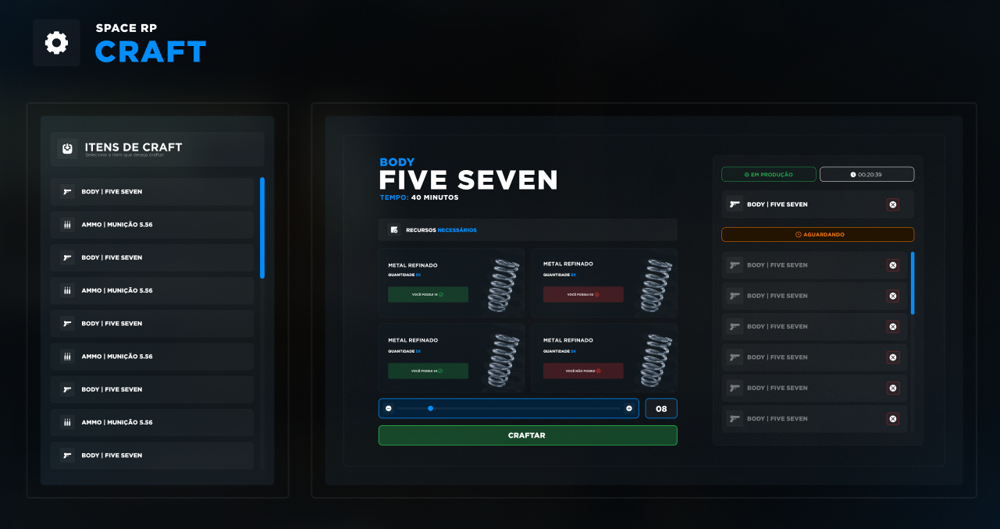

<h1 align="center">
    CRAFT
</h1>
<p align="center"> Application developed for Space 💻🚀 </p>

<p align="center">
 <a href="#objective">Objective</a> •
 <a href="#technologies">Technologies</a> • 
 <a href="#usage">Usage</a> • 
 <a href="#contribution">Contribution</a> • 
 <a href="#author">Author</a> • 
 <a href="#license">License</a>
</p>

<h1 align="center">
<div style="display: flex; flex-direction: row;">
  
<div>
</h1>

<h4 align="center"> 
	🚧 Space | ⏰📈 Loading...  🚧
</h4>

<h2 id="objective" > 🎯 Objective </h2>

Interface developed for crafting items system for a FiveM RolePlay server | Space

<h2 id="technologies"> 🛠 Technologies </h2>

The following tools were used in the construction of the project:

- [ReactJS](https://reactjs.org)
- [Vite](https://vitejs.dev)
- [TailwindCSS](https://tailwindcss.com)
- [NodeJS](https://nodejs.org/en/)
- [Yarn](https://yarnpkg.com) or NPM
- [VSCode](https://code.visualstudio.com)
- [Git Bash](https://gitforwindows.org/)

<h2 id="usage" > 👷 Usage </h2>

Required! Install git, node and yarn (or npm).

```bash
# Clone Repository
$ git clone https://github.com/pedroribeiroo/craft.git

# Go to server folder
$ cd craft

# Install Dependencies
$ yarn

# Run Aplication
$ yarn dev

# Access localhost
http://localhost:3000
```

<h2 id="contribution"> 🤝 Contribution </h2>

This project is for study purposes too!

<h2 id="author"> 💻 Author </h2>


By Pedro Ribeiro with 💙 Enjoy it!

<h2 id="license"> 📝 License </h2>

This project is under the MIT license.
